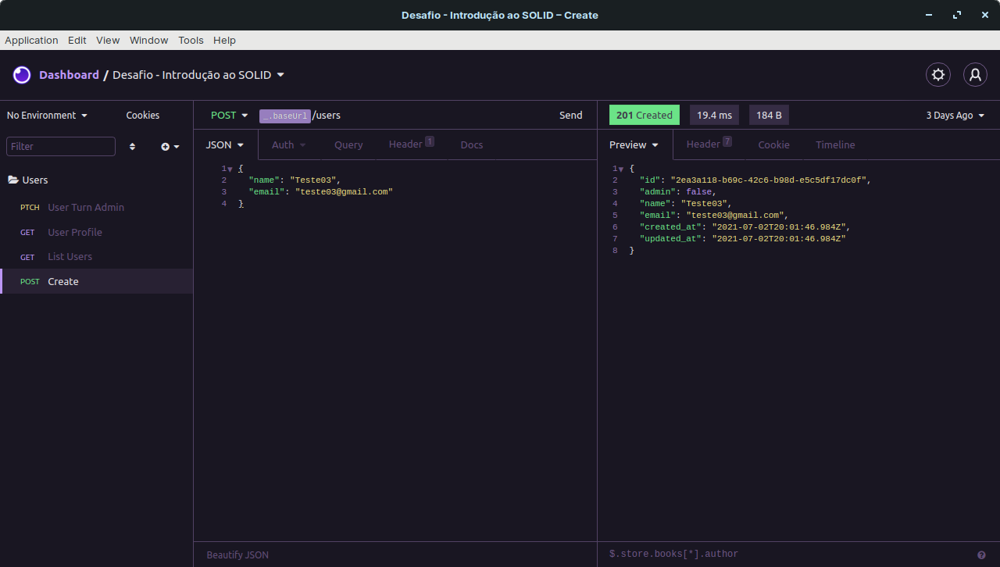

## Sobre
Esse desafio teve como objetivo colocar em pratica o que foi aprendido sobre TypeScript, padrões de código e princípios do SOLID, casos de uso, repositórios, models, streams do Node.js e documentação de APIs com Swagger.
## Instalação
Você precisa das seguintes ferramentas instaladas para executar este projeto:

[Node.js](https://nodejs.org/en/download/), [Yarn](https://yarnpkg.com/).

```bash
# Faça um clone
$ git clone https://github.com/Jacoappolinario/Desafio-introducao-ao-SOLID.git

# Navegue até o repositório clonado:
$ cd Desafio-introducao-ao-SOLID

# Baixe as dependências:
$ yarn install

# Divirta-se
$ yarn dev
```
    
## Rodando os Testes

Para executar os testes, execute o seguinte comando

```bash
  yarn test
```

  
## Screenshots



  
